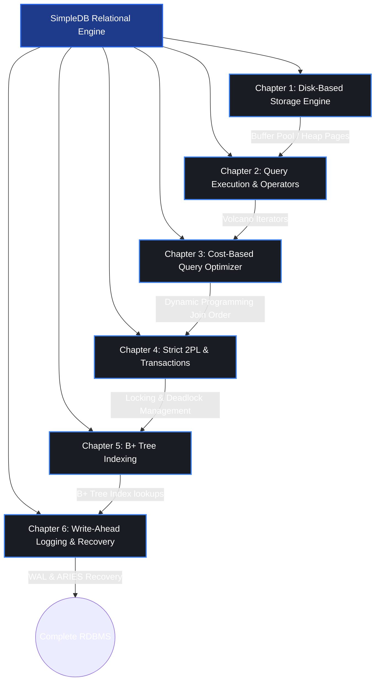

# SimpleDB Learning Guide & Internship Curriculum

Welcome to the **SimpleDB Study Guide**! This comprehensive documentation is designed to walk you through the internals of relational database management systems (RDBMS) by analyzing and building **SimpleDB**—the educational database system developed at MIT for the 6.830 (Database Systems) course.

This guide bridges the gap between database theory (textbook concepts) and concrete software engineering (implementing a working RDBMS from scratch in Java).

---

## 📚 Core Recommended Textbooks & Reference Papers

To get the most out of this curriculum, we highly recommend reading the corresponding chapters in these classic books and paper surveys:

1. **Primary Textbook:**
   - *Database System Concepts (SKS)* by Silberschatz, Korth, and Sudarshan (7th Edition).
   - *Database Management Systems (R&G)* by Raghu Ramakrishnan and Johannes Gehrke (3rd Edition).

2. **Core Architectural Surveys:**
   - *Architecture of a Database System* by Joseph M. Hellerstein, Michael Stonebraker, and James Hamilton (Foundations and Trends in Databases, 2007).
   - *Selected papers* on index structures, query optimization (Selinger), and recovery (ARIES).

---

## 🗺️ Syllabus & Learning Chapters

The curriculum is divided into **six distinct chapters**, matching the evolution of a relational database:



### 📂 [Chapter 1: Disk-Based Storage Engine](file:///Users/surendraraika/projects/learning/dbms/lab-mit/documentation/notes/Chapter_1_Storage_Engine.md)
*Learn how bytes on a spinning disk or SSD represent structured relational data in memory.*
- **Key Concepts:** Field-level types, Slotted-page architecture, HeapFiles, the BufferPool (volatile cache), and sequential scans.
- **Goal:** Read a database file from disk, convert it into Java tuples, and scan it sequentially.

### 📂 [Chapter 2: Query Execution & Operators](file:///Users/surendraraika/projects/learning/dbms/lab-mit/documentation/notes/Chapter_2_Operators_Execution.md)
*Learn how queries are executed using standard execution engine frameworks.*
- **Key Concepts:** The Volcano Iterator Model (`open`, `next`, `close`), Filter & Join operators, Group-By Aggregations, and Tuple Mutations (Insert/Delete).
- **Goal:** Build full relational query pipelines (e.g., `SELECT ... WHERE ... JOIN ... GROUP BY ...`).

### 📂 [Chapter 3: Cost-Based Query Optimizer](file:///Users/surendraraika/projects/learning/dbms/lab-mit/documentation/notes/Chapter_3_Query_Optimization.md)
*Learn how a database evaluates millions of possible ways to run a query and picks the fastest one.*
- **Key Concepts:** Selectivity estimation using data histograms, cost modeling, and Selinger's dynamic programming join optimizer.
- **Goal:** Estimate costs and optimize join order for arbitrary multi-way joins.

### 📂 [Chapter 4: Strict 2PL & Transactions](file:///Users/surendraraika/projects/learning/dbms/lab-mit/documentation/notes/Chapter_4_Transactions_Concurrency.md)
*Learn how to allow thousands of users to read and write data concurrently without corruption.*
- **Key Concepts:** ACID properties, Shared/Exclusive locks, Strict Two-Phase Locking (2PL), Lock Manager architecture, and Deadlock detection/prevention.
- **Goal:** Coordinate concurrency in the `BufferPool` to prevent race conditions and resolve deadlocks.

### 📂 [Chapter 5: B+ Tree Indexing](file:///Users/surendraraika/projects/learning/dbms/lab-mit/documentation/notes/Chapter_5_BPlus_Tree.md)
*Learn how databases build highly-branched balanced search trees to accelerate point lookups and range scans.*
- **Key Concepts:** B+ Tree structure, Leaf vs. Internal Nodes, Root Pointer management, Page Splitting (Insert), Page Merging & Stealing (Delete).
- **Goal:** Implement the point traversal lookup (`findLeafPage`) and tree rebalancing operations.

### 📂 [Chapter 6: Write-Ahead Logging & Recovery](file:///Users/surendraraika/projects/learning/dbms/lab-mit/documentation/notes/Chapter_6_Recovery_WAL.md)
*Learn how a database ensures that committed data is never lost, even if the power cable is pulled mid-write.*
- **Key Concepts:** Write-Ahead Logging (WAL) protocol, NO-FORCE/STEAL policies, Checkpoints, and the three phases of ARIES recovery (Analysis, Redo, Undo).
- **Goal:** Implement the `rollback` and `recover` functions to parse binary logs and restore the database state.

---

## 🛠️ Codebase Structure

The database code is located in the [src/](file:///Users/surendraraika/projects/learning/dbms/lab-mit/src) directory:

```bash
src/java/simpledb/
├── common/        # Types, Utility, Catalog, and Database Context
├── storage/       # Pages, HeapFiles, B+ Tree Files, Tuples, Fields, and BufferPool
├── execution/     # Volcano operators (SeqScan, Filter, Join, Aggregate)
├── optimizer/     # Histograms, Cost Formulas, and Selinger Optimizer
├── transaction/   # Transaction ID, Permissions, and Locking Control
└── index/         # B+ Tree Indexing implementation details
```

---

## � Implementation Logs

- **[Lessons Learned](lessons_learned.md)** — Running log of gotchas, build issues, and insights organized by chapter.
- **[Exercise Walkthrough](exercise_walkthrough.md)** — LLD and code-level walkthrough of every exercise: data structures, algorithms, and call flows.

---

## �🚀 Let's Get Started!

To begin your journey into database internals, open **[Chapter 1: Disk-Based Storage Engine](file:///Users/surendraraika/projects/learning/dbms/lab-mit/documentation/notes/Chapter_1_Storage_Engine.md)** to see the design and implementation roadmap for the storage layer.
